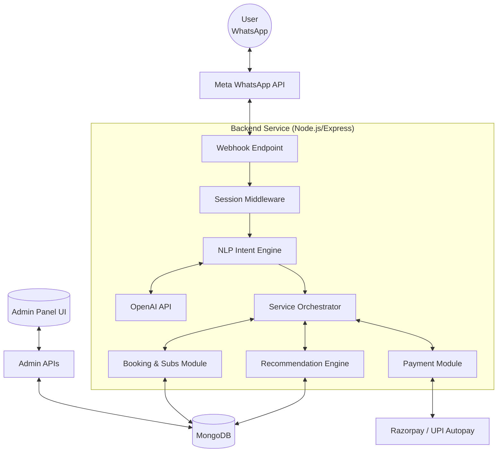
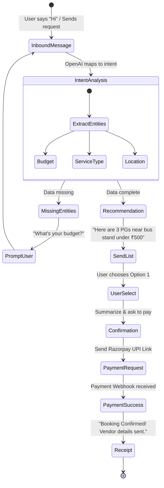

# Hyperlocal Super-Concierge: System Architecture & Plan

This document outlines the system architecture, database schema, API design, and development plan for the AI-powered Hyperlocal Super-App intended for Tier-2 cities in India. The solution prioritizes a WhatsApp-first, low-cost, scalable approach.

> [!IMPORTANT]  
> Please review this architecture plan. It involves selecting Node.js + Express with MongoDB and Meta's WhatsApp Cloud API. Let me know if you would prefer Python/FastAPI or a relational database like PostgreSQL before we proceed with initialization.

## User Review Required

- **Tech Stack Confirmations**: Node.js vs Python. Node.js is proposed here for its highly asynchronous nature which fits well with webhooks and WhatsApp API integrations.
- **WhatsApp Provider**: Meta Cloud API is proposed as it is free of middleman markups compared to Twilio, aligning with the "Low Cost" requirement.
- **Database**: MongoDB is proposed due to the heterogenous nature of vendors (PGs have different attributes than Kirana stores or Auto drivers), allowing flexible document structures. 


## 1. System Architecture Diagram



## 2. Database Schema (MongoDB)

We will use MongoDB collections to flexibly manage different entity types.

### `Users` Collection
```json
{
  "_id": "ObjectId",
  "phoneNumber": "+918888888888",
  "name": "Rahul",
  "language": "hi", // 'en' or 'hi'
  "city": "Kota",
  "createdAt": "Date",
  "preferences": {
    "dietary": "veg",
    "budget": "low"
  }
}
```

### `Vendors` Collection
```json
{
  "_id": "ObjectId",
  "businessName": "Sharma Tiffin Service",
  "type": "FOOD", // PG, FOOD, GROCERY, TRANSPORT
  "ownerPhone": "+919999999999",
  "location": {
    "type": "Point",
    "coordinates": [75.83, 25.18],  // geoJSON for proximity search
    "address": "Landmark City, Kota"
  },
  "pricing": {
    "basePrice": 2500, // Monthly
    "currency": "INR"
  },
  "attributes": { // Varies by type
    "mealsPerDay": 2, // For FOOD
    "roomType": "Single", // For PG
  },
  "rating": 4.5,
  "isActive": true
}
```

### `Bookings` (Orders & Subscriptions) Collection
```json
{
  "_id": "ObjectId",
  "userId": "ObjectId(Users)",
  "vendorId": "ObjectId(Vendors)",
  "type": "SUBSCRIPTION",
  "status": "ACTIVE", // PENDING, CONFIRMED, ACTIVE, CANCELLED
  "paymentStatus": "PAID",
  "startDate": "Date",
  "endDate": "Date",
  "amount": 2500,
  "bundleId": "ObjectId(Bundles)" // Optional if part of a move-in kit
}
```

## 3. API Design (Endpoints)

Base URL: `/api/v1`

### Webhook (WhatsApp)
- `GET /webhook/whatsapp` : Meta webhook verification.
- `POST /webhook/whatsapp` : Receive incoming WhatsApp messages.

### Vendor Management
- `POST /vendors` : Create a new vendor (Admin).
- `GET /vendors` : List vendors with filters (type, location, budget).
- `PUT /vendors/:id` : Update vendor details.

### Bookings & Payments
- `POST /bookings` : Create a new booking request.
- `POST /payments/webhook` : Handle Razorpay/UPI payment status updates.
- `POST /payments/subscription` : Setup UPI Autopay mandate.

## 4. WhatsApp Chatbot Conversation Flow



## 5. MVP Development Plan (Step-by-Step)

### Week 1: Foundation & Setup
- Set up Node.js repository and MongoDB Database.
- Configure Meta Developer Account, create WhatsApp App, get API keys.
- Create `/webhook` endpoint to echo WhatsApp messages.

### Week 2: AI & NLP Integration
- Connect OpenAI API.
- Create prompt templates to extract JSON (`intent`, `location`, `budget`, `serviceType`) from user messages.
- Implement session state management (Redis or in-memory) to remember conversation context.

### Week 3: Database & Core Logic
- Define Mongoose Models (User, Vendor, Booking).
- Manually seed DB with 10–15 mock vendors for a specific test city.
- Connect NLP output to Database queries (e.g., Geo-spatial search for nearby PGs).

### Week 4: Booking & Payments
- Integrate Razorpay API for generating UPI payment links.
- Send interactive WhatsApp messages (lists/buttons) showing vendor options and Pay buttons.
- Handle payment webhooks and send confirmation receipts.

### Week 5: Testing & Deployment
- Comprehensive internal testing.
- Deploy to AWS/Render.
- Go live in one test region for beta testers.

## 6. Folder Structure for Backend

```text
/src
  /config         # Environment vars, DB config, Meta API config
  /controllers    # HTTP route handlers
  /models         # Mongoose DB Schemas
  /routes         # Express API routing definitions
  /services
    - openai.service.js      # NLP extraction logic
    - whatsapp.service.js    # Send/Receive WhatsApp templates
    - payment.service.js     # Razorpay integration
    - workflow.service.js    # Core state machine for chat flow
  /utils          # Helper functions, loggers
  app.js          # Express app setup
  server.js       # Entry point
```

## 7. Sample Code for Chatbot Integration (Node.js)

```javascript
// src/controllers/webhook.controller.js
const { handleMessageWorkflow } = require('../services/workflow.service');

exports.receiveWhatsAppMessage = async (req, res) => {
  // Acknowledge receipt to Meta immediately
  res.sendStatus(200);

  const { entry } = req.body;
  if (entry && entry[0].changes && entry[0].changes[0].value.messages) {
    const message = entry[0].changes[0].value.messages[0];
    const userPhone = message.from;
    const textBody = message.text?.body;

    if (textBody) {
      // Pass to our core NLP and recommendation engine
      await handleMessageWorkflow(userPhone, textBody);
    }
  }
};
```

```javascript
// src/services/workflow.service.js
const openai = require('./openai.service');
const whatsapp = require('./whatsapp.service');
const Vendor = require('../models/Vendor');

exports.handleMessageWorkflow = async (userPhone, text) => {
  // 1. Ask AI to analyze the message
  const intentData = await openai.extractIntent(text);
  
  if (intentData.intent === 'FIND_ROOM') {
    // 2. Query DB based on AI extracted budget/location
    const rooms = await Vendor.find({
      type: 'PG',
      'pricing.basePrice': { $lte: intentData.budget || 5000 }
    }).limit(3);

    // 3. Format and send response back to WhatsApp
    const replyText = `Found ${rooms.length} rooms under ₹${intentData.budget}. Reply with 1, 2, or 3 to book.`;
    await whatsapp.sendMessage(userPhone, replyText);
  }
};
```

## 8. Deployment Guide

**Option: Render (App) + MongoDB Atlas (DB) - Recommended for Low Cost/MVP**

1. **Database Allocation**:
   - Create a free tier cluster on MongoDB Atlas.
   - Whitelist IP `0.0.0.0/0` (or Render's specific IPs).
   - Get the connection string.
2. **Environment Variables**:
   - Add `.env` variables to Render: `MONGO_URI`, `OPENAI_API_KEY`, `WHATSAPP_TOKEN`, `WHATSAPP_PHONE_ID`, `RAZORPAY_KEY`, `RAZORPAY_SECRET`.
3. **App Deployment**:
   - Link your GitHub repo to Render as a "Web Service".
   - Start command: `node src/server.js`
4. **Meta Webhook Setup**:
   - Take the deployed URL from Render (e.g., `https://my-hyperlocal-app.onrender.com/api/v1/webhook/whatsapp`).
   - Paste it into the Meta WhatsApp Developer portal.
   - Add your custom verify token.

---

> [!TIP]
> **Next Steps:** If this architecture looks good, I can initialize the Node.js project, set up the folder structure, and install the necessary dependencies in the workspace right away!
